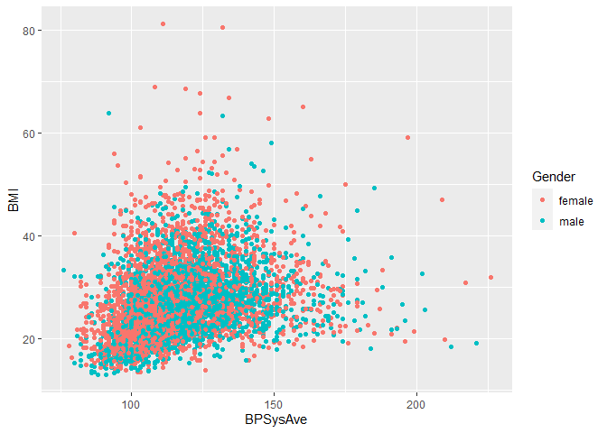

aprender_act2_luishernandez
================
Luis G. Hernández
2023-07-26

Este documento se utilizará para seguir las indicaciones de la actividad
2, objetivos 1 y 2.

``` r
# Se instala/carga el paquete NHANES, la actividad 2 requiere que NO haya comandos "install.packages"
library("NHANES")

# Carga la base de datos "NHANES"
data("NHANES", package = "NHANES")
```

Este paquete toma los resultados de la *American National Health and
Nutrition Examination Surveys*, que realiza encuestas complejas para
realizar estimaciones acerca de la población de Estados Unidos durante
los años de 2009 a 2012 con ciertos ajustes necesarios para evitar la
sobrerrepresentación de minorías.

Dentro de las variables que presenta este paquete se encuentran las
siguientes categorías:

- **Var. de estudio**
  - ID (int)
  - SurveyYr (fct)
- **Var. demográficas**
  - Gender (int)
  - Age (fct)
  - Education (fct)
- **Var. de medidas físicas**
  - Weight (dbl)
  - Height (dbl)
  - BMI (*Índice de Masa Corporal*, dbl)
  - BPSys1 (*Primera medida presión arterial sistólica*, dbl)
- **Var. de estilo de vida**
  - PhysActive (fct)
  - TVHrsDay (fct)
- **Var. de salud**
  - TotChol (dbl)
  - Diabetes (fct)

Podemos conocer el número de observaciones y la cantidad de variables
declaradas en este paquete:

``` r
# Obtenemos el número de observaciones dentro de NHANES
nrow(NHANES)
```

    ## [1] 10000

``` r
# Obtenemos el número de variables dentro de NHANES
ncol(NHANES)
```

    ## [1] 76

El tamaño de esta base de datos nos permite crear ilustración para
digerir mejor la cantidad de información que se maneja, como el
siguiente ejemplo, que usa las variables **IMC** y **Presión arterial
sistólica media**.

<!-- -->
